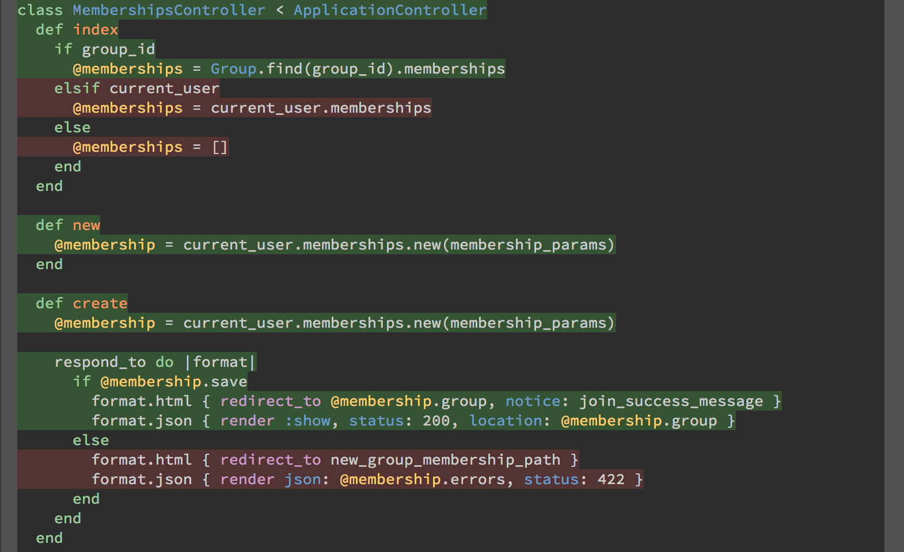

Code coverage highlighting for Emacs
=======================================================

`coverage-mode` is an Emacs minor mode that enables the highlighting
of lines within buffers to indicate their code coverage status, as
determined by your test suite.

Installation
=============

`coverage-mode` is available on [MELPA](http://melpa.org) and
[MELPA-STABLE](http://stable.melpa.org)

You can install `coverage-mode` with the following command.

<kbd>M-x package-install [RET] coverage [RET]</kbd>

Usage
=====

To enable `coverage-mode` in the current buffer, use `M-x
coverage-mode RET`.

Repeat this command to disable `coverage-mode` for the current
buffer.

Once enabled in a buffer, highlighting will be automatically updated
as the test coverage for that file changes. You may enable and disable
`coverage-mode` independently for multiple files in the same project.

Currently `coverage-mode` only works with output as supplied by the
[SimpleCov](https://github.com/colszowka/simplecov) gem, and it is
only configured to work with [RSpec](https://github.com/rspec/rspec)
results.

Configuration
====

By default, `coverage-mode` looks in your current `vc-git-root`
directory for the `coverage/.resultset.json` file. You can configure
this to whatever filepath you want through the `Coverage Dir`
customization variable.

You can also choose your own `faces` for covered & uncovered lines
through customization variables. These default to green for covered &
red for uncovered.

You may also wish to customize `coverage-interval` if you want more
(or less) responsive coverage highlight updates.

